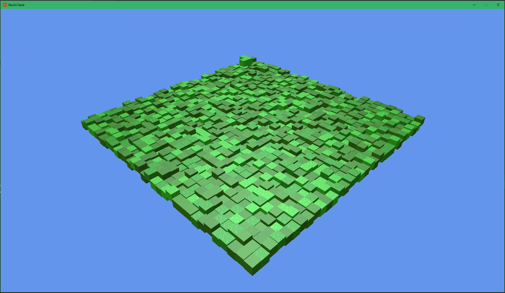
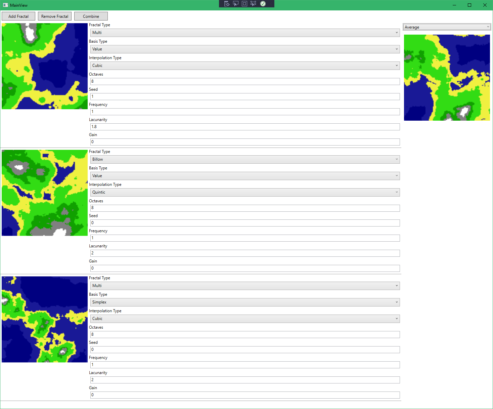

 
# Nord

Isometric Game made with [MonoGame](https://github.com/MonoGame/MonoGame)

This is an experimental isometric game, potentially becoming a real game one day.

# Tools

## SimplexStudio

To figure out parameters for world generating noise generators used in Nord.

## AtlasStudio

Compose Texture Atlas from various sources.
